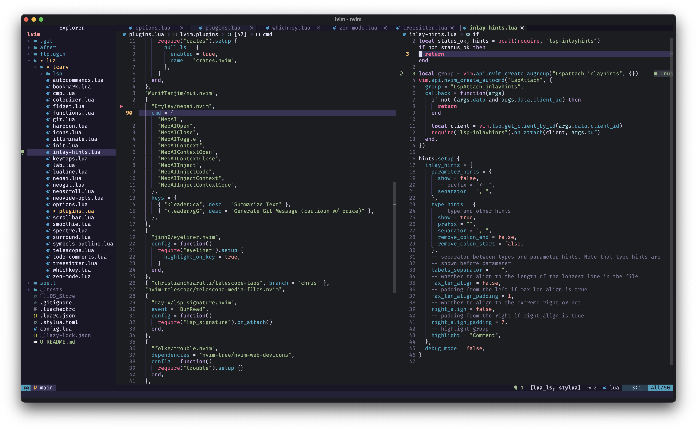

## Lunarvim (+ Neovide - optional) 

This configuration is stripped from [Chris Chiarulli](https://github.com/ChristianChiarulli/lvim).

For more info on how to set up head to [Lunarvim](https://www.lunarvim.org), and check the github repo on how to setup a full IDE for specific languages.

### Using Neovide with Lunarvim

To run Lunarvim inside Neovide, use the shell script at the root - `neolvim.sh`
For better experience add this to your zshrc -> `alias lv="/Users/lcarv/.config/lvim/neolvim."`
